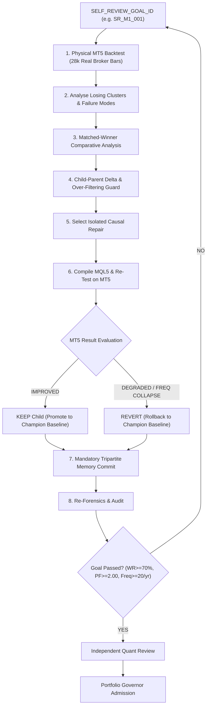

# 🏛️ StratX 3-Tier Self-Healing Hierarchy Specification

> **Tier 1 heals until the strategy goal passes. Tier 2 ensures every attempt changes institutional memory. Tier 3 uses accumulated institutional experience to improve how future agents perform Tier 1.**  
>  
> **No Tier may declare success merely because its current tasks, experiment, generation, or iteration finished. The active goal owns completion.**

---

## 🗺️ High-Level Architectural Flow

```
┌─────────────────────────────────────────────────────────────────────────────┐
│ TIER 1 — STRATEGY SELF-HEALING (The Quantitative Loop)                      │
│ "What is wrong with this EA and how do I repair it?"                        │
│                                                                             │
│ [SELF_REVIEW_GOAL_ID]                                                       │
│      ↓                                                                      │
│ MT5 Backtest → Analyse Losers → Matched Winners → Find Clusters →           │
│ Child-Parent Delta → Isolated Causal Mutation → Test Child → Keep / Revert  │
│      ↓                                                                      │
│ Memory Commit → Re-Forensics → Goal Passed? (NO ──→ Loop back under Goal)  │
│                                              (YES ─→ Review → Governor)    │
└──────────────────────────────────────┬──────────────────────────────────────┘
                                       │
                                       ▼
┌─────────────────────────────────────────────────────────────────────────────┐
│ TIER 2 — BRAIN / EXPERIENCE MEMORY (The Knowledge Graph)                     │
│ "What have we learned from previous experiments?"                           │
│                                                                             │
│ Experiment → Predicted Outcome → Actual Outcome → Belief Update (Delta) →   │
│ Strategy Lesson → Research Lesson → Persist Knowledge Graph → Retrieve      │
└──────────────────────────────────────┬──────────────────────────────────────┘
                                       │
                                       ▼
┌─────────────────────────────────────────────────────────────────────────────┐
│ TIER 3 — META SELF-HEALING / SKILLOPT (The Recursive Evolutionary Layer)    │
│ "How should the researcher itself become better at researching?"             │
│                                                                             │
│ Harvest Many Missions → Identify Recurring Cognitive Failures →             │
│ Propose Bounded Skill Mutation → Replay Historical Benchmark Episodes →    │
│ Held-Out Validation Gate → Accept/Reject Skill Edit → Next Epoch            │
└─────────────────────────────────────────────────────────────────────────────┘
```

---

## 🔬 TIER 1 — STRATEGY SELF-HEALING ENGINE (The Grinding Machine)

### 🎯 Core Purpose: *"What is wrong with this EA and how do I repair it?"*

Tier 1 is an autonomous, persistent quantitative state machine. It does **NOT** run as a linear to-do checklist. It is governed by a persistent `SELF_REVIEW_GOAL_ID` (e.g. `SR_M1_001`) that stays active until the strategy satisfies all institutional module gates or is formally escalated/falsified.



---

### 🔍 1. Forensic Discovery Taxonomy
During trade telemetry analysis, the engine discovers specific empirical failure modes:
- **Time/Session Failure**: Asian low-volatility drift, pre-open spread expansion, Friday evening illiquidity.
- **Direction Asymmetry**: Short-side drag during structural index bull regimes.
- **Volatility Failure**: False triggers during ultra-low volatility or high-volatility news spikes.
- **Microstructure / Region**: Bad indicator region, stale FVG mitigation, illiquid price levels.
- **Timing & Geometry**: Premature entry before liquidity sweep confirmation, chase entries.
- **Exit & Order Dispatch**: Fixed TP too rigid, stop too tight for local ATR, premature BE trigger.
- **Regime Failure**: Trend-following filters triggering inside choppy consolidation.

---

### 🛠️ 2. Comparative Matched-Winner Repair Spectrum
The Council formulates an **isolated causal mutation where scientifically possible**:
1. **Sharpen / Loosen Gates**: Adjust existing thresholds based on empirical trade distributions.
2. **Add Evidence-Supported Gate**: Inject a single regime, session, or volatility filter verified by matched controls.
3. **Remove Useless Filter**: Eliminate redundant conditions causing trade frequency collapse.
4. **Session Window Refinement**: Block proven toxic hours (e.g. restrict to 07:00–16:30 GMT).
5. **Entry Geometry Calibration**: Require clean sweep rejection wick and equilibrium mitigation.
6. **Stop / Target Calibration**: Adapt SL/TP to local ATR dynamics and structural swing points.
7. **Exit Architecture Overhaul**: Deploy FBL (Flagship Balanced Logic) 50% partial close at 1.0R + BE buffer + trailing stop.
8. **Component / Architecture Replacement**: Overhaul Block 3 (Regime) or Block 4 (Alpha Trigger).
9. **Thesis Inversion (Level-5)**: If breakout persistently fails, invert to fade breakouts.

---

### ⚖️ 3. Execution & Evaluation Protocol:
- **`IF CHILD IMPROVES`**:
  - Promote child as the new parent champion baseline.
  - Re-analyse the new trade population under the **SAME** `SELF_REVIEW_GOAL_ID`.
- **`IF CHILD DEGRADES OR FREQUENCY COLLAPSES`**:
  - Rollback immediately to last champion baseline.
  - Write failure signature and debunked hypothesis to StratX Brain.
  - Select a mutually exclusive repair and continue under the **SAME** `SELF_REVIEW_GOAL_ID`.

---

## 🧠 TIER 2 — BRAIN / EXPERIENCE MEMORY (The Knowledge Graph)

### 🎯 Core Purpose: *"What have we learned from previous experiments?"*

The StratX Brain prevents circular research by enforcing an auditable, append-only knowledge graph:

1. **Tripartite Memory Engine**:
   - **`Strategy Memory`**: Complete compilable source code, verified SET parameters, trade count, WR, PF, Realised Payoff, and Drawdown.
   - **`Belief Memory`**: Prior hypothesis vs posterior empirical outcome, updating confidence based on **evidence quality** (sample size, out-of-sample stability, matched controls, contradictions, implementation fidelity, provenance).
   - **`Research Policy Memory`**: Empirical methodological lessons (e.g., *"Filter accretion destroys out-of-sample robustness"*).
2. **Evidence Dependency Lineage Graph**:
   - Graph nodes: `FEATURE` $\to$ `FORENSIC_OBSERVATION` $\to$ `HYPOTHESIS` $\to$ `EXPERIMENT` $\to$ `MT5_REPORT` $\to$ `REVIEW_VERDICT` $\to$ `MODULE_FREEZE`.
   - **Cascade Invalidation**: If an upstream foundation fails stress testing, all derived downstream rules are automatically invalidated.
3. **Pre-Compute Proposal Gate**:
   - Queries `stratx_brain.json` before compilation. Blocks repeat trials of debunked experiments unless justified by material context difference.

---

## 🧬 TIER 3 — META SELF-HEALING / SKILLOPT (Researcher Cognitive Evolution)

### 🎯 Core Purpose: *"How should the researcher itself become better at researching?"*

SkillOpt is an offline meta-learning engine that treats the agent’s skill documents (`SKILL.md`) as trainable state:

```
Harvest Many Missions
        ↓
Mine Recurring Cognitive Errors (e.g. Filter Accretion, Confirmation Bias)
        ↓
Propose Bounded Skill Mutation (Markdown Diff)
        ↓
Replay STRATX_RESEARCH_BENCHMARK Episodes (Train Set)
        ↓
Held-Out Validation Gate (Unseen Historical Research Missions)
        │
    NO ─┴─→ REJECT EDIT (Restore Baseline Skill)
        │
       YES
        ↓
PROMOTE NEW CANONICAL SKILL VERSION
```

---

## 🛡️ Strict System Boundaries: Frozen Invariants vs Evolvable Intelligence

SkillOpt optimizes the **cognitive reasoning and heuristics**, but NEVER touches the deterministic execution harness:

| Layer | Component | Status | Description |
| :--- | :--- | :--- | :--- |
| **IMMUTABLE INVARIANTS** | `SELF_REVIEW_GOAL` State Machine | **FROZEN** | Controls goal ownership, persistence, and termination. |
| **IMMUTABLE INVARIANTS** | Risk & Position Sizing | **FROZEN** | Strict 1.0% dynamic equity risk, 1 concurrent position. |
| **IMMUTABLE INVARIANTS** | Physical MT5 Execution & Harness | **FROZEN** | Real Vantage broker ticks, spread, slippage, and swap modeling. |
| **IMMUTABLE INVARIANTS** | Module Pass Gates | **FROZEN** | $\text{WR} \ge 70.0\%, \text{PF} \ge 2.00, \text{Freq} \ge 20.0/\text{yr}, \text{Payoff} \ge 1.00$. |
| **IMMUTABLE INVARIANTS** | Mathematical Calculations | **FROZEN** | Trade accounting, portfolio DD, child-parent deltas, statistical tests. |
| **IMMUTABLE INVARIANTS** | Evidence Integrity & Invariants | **FROZEN** | SHA-256 report hashing, sample provenance ($N \ge 5$), mandatory memory commits. |
| **IMMUTABLE INVARIANTS** | Institutional Governance | **FROZEN** | Independent Reviewer & Portfolio Governor gates. |
| **EVOLVABLE TIER 1** | Strategy Logic (`.mq5`) | **EVOLVABLE** | Alpha triggers, regime filters, entry/exit parameters. |
| **APPEND-ONLY TIER 2** | Knowledge Graph (`stratx_brain.json`)| **APPEND-ONLY**| Institutional memories, belief states, lineage graph nodes. |
| **EVOLVABLE TIER 3** | Researcher Skills (`.md`) | **EVOLVABLE** | Cognitive skill instructions, prompt heuristics, failure classification guides. |
