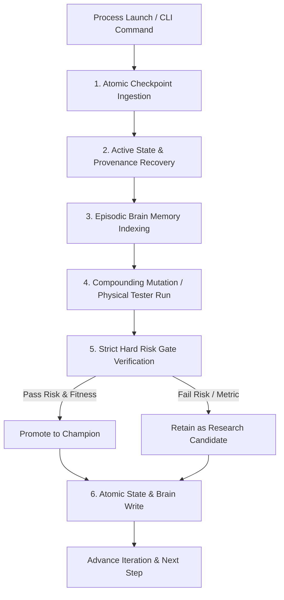

# Stateful Mission Continuation

## Overview

Autonomous research desks and multi-agent systems often run across hours, days, or weeks. Without strict stateful persistence invariants, process terminations (crashes, system reboots, user `Ctrl+C`, network timeouts) cause catastrophic resets:
1. Re-running experiments that were already completed or debunked.
2. Promoting unverified or illegal candidates as champions upon cold restart.
3. Reporting child absolute metrics as false "improvements" over a missing parent.
4. Losing episodic causal memory across restarts.

**Core Principle:** *The Goal owns the loop; the physical process is ephemeral.* Every iteration must be atomic, crash-resilient, and fully recoverable from cold disk storage.

---

## The 6 Laws of Stateful Mission Continuation



### Law 1: Atomic Checkpoint Serialization
Every state transition must write an atomic snapshot to persistent disk (`campaign_state.json`).
- Write to a temporary file first (`.tmp`) and atomically rename to avoid corrupted partial writes on sudden power loss.
- Save immediately after:
  1. Goal initialization / phase transitions.
  2. Physical MT5 / tester backtest completion.
  3. Champion promotion or candidate rejection.
  4. Memory commitment to episodic vector/JSON store.

### Law 2: Immutable Provenance & True Delta Accounting
Never report absolute metrics as delta improvements over a missing parent.
- If no verified champion exists (`parent_metrics is None`):
  - Mark status as `INITIAL_SEED_BASELINE`.
  - All delta fields ($\Delta N, \Delta WR, \Delta PF, \Delta DD, \Delta RR$) MUST be reported as $0.0$.
- When a valid champion exists:
  $$\Delta N = N_{child} - N_{parent}$$
  $$\Delta WR = WR_{child} - WR_{parent}$$
  $$\Delta PF = PF_{child} - PF_{parent}$$
  $$\Delta DD = DD_{child} - DD_{parent}$$
  $$\Delta RR = RR_{child} - RR_{parent}$$

### Law 3: Non-Negotiable Hard Risk Gates (Anti-Coronation Invariant)
A candidate strategy must NEVER be promoted to Champion if it breaches hard risk boundaries, regardless of how high its Win Rate or raw fitness score appears:
- **Drawdown Ceiling**: $\text{MaxDD} \le 10.0\%$ (or $\le 6.0\%$ for canonical acceptance).
- **Profit Factor Floor**: $\text{PF} \ge 1.10$ minimum viable economic threshold ($\ge 2.00$ target).
- **Consecutive Losses Ceiling**: $\text{Max Consecutive Losses} \le 8$.
- **Payoff Symmetry Check**: If $WR \ge 70\%$ and $PF < 1.30$, flag severe payoff compression ($\text{AvgWin} \ll \text{AvgLoss}$) and block promotion until runner mechanics are repaired.

### Law 4: The Memory Commitment Invariant
Before starting a new mutation or physical backtest:
- Check if the previous iteration committed its learning to episodic memory (`stratx_brain.json`).
- If uncommitted (e.g. process died mid-autopsy), force-commit a tombstone record before allowing new experiments.
- Never test a mutation identical to a `DEBUNKED` entry in brain memory without an explicit structural hypothesis difference.

### Law 5: Dynamic Context-Aware Self-Healing Action
The Self-Heal HUD and council prompts must never use static/hardcoded copy. Healing actions must dynamically reflect the active failure mode:
- **High Drawdown ($\text{MaxDD} > 10\%$)**: Target loss clustering, adverse excursion (MAE), and trailing stop giveback.
- **Payoff Asymmetry ($WR \ge 70\%, PF < 1.30$)**: Target runner capture, stop distance, and asymmetric loss tail.
- **Consecutive Losses ($\ge 6$)**: Target macro regime drift and adverse session hours.
- **Frequency Collapse ($N < 20/\text{yr}$)**: Target over-restrictive Block 2/3 filters and broaden Block 4 trigger geometry.

### Law 6: Zero-Friction One-Command CLI Launcher
Provide a single, location-agnostic shell command (e.g. `quants`) that:
1. Re-activates `goal_status = "ACTIVE"`.
2. Releases any lingering MT5 / background process locks.
3. Automatically ingests the latest `campaign_state.json` and resumes execution.

---

## State Schema Reference

```json
{
  "iteration": 110,
  "active_thesis_index": 0,
  "thesis_iteration_count": 2,
  "research_phase": "PHASE_1_DISCOVERY",
  "repair_level_idx": 1,
  "goal_status": "ACTIVE",
  "portfolio_modules": [],
  "champion_thesis": "X1X_M1_PDC",
  "champion_code": "<full_mql5_code>",
  "champion_metrics": {
    "total_trades": 181,
    "win_rate": 0.718,
    "profit_factor": 2.14,
    "max_drawdown": 0.052,
    "max_consecutive_losses": 4
  },
  "champion_score": 143.2,
  "lineage_note": "CHAMPION PROMOTED: Mutation improved PF from 1.62 to 2.14 across 181 trades.",
  "awaiting_memory_commit": false
}
```

---

## Verification & Recovery Checklist

When auditing a stateful goal loop:
1. [ ] Terminate process with `Ctrl+C` mid-backtest $\to$ restart with `quants` $\to$ verify it recovers iteration count and active thesis.
2. [ ] Inject a high-win-rate, blown-drawdown child ($WR=75\%, DD=25\%$) $\to$ verify promotion is strictly `FORBIDDEN`.
3. [ ] Check HUD delta output $\to$ verify no child absolute values masquerade as $+74\%$ delta improvements.
4. [ ] Check brain memory $\to$ verify all historical experiments are queried before proposing new code mutations.
